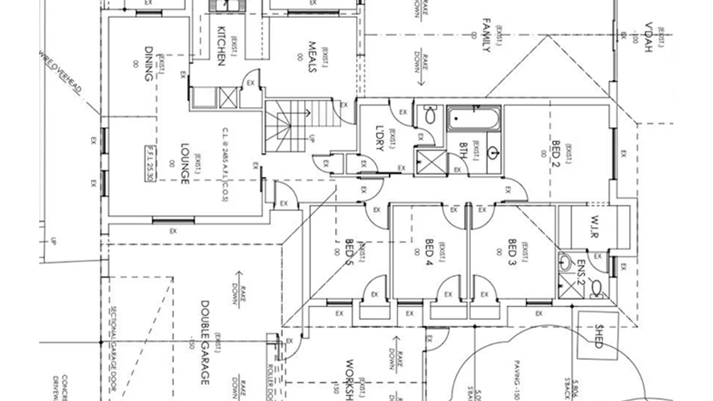
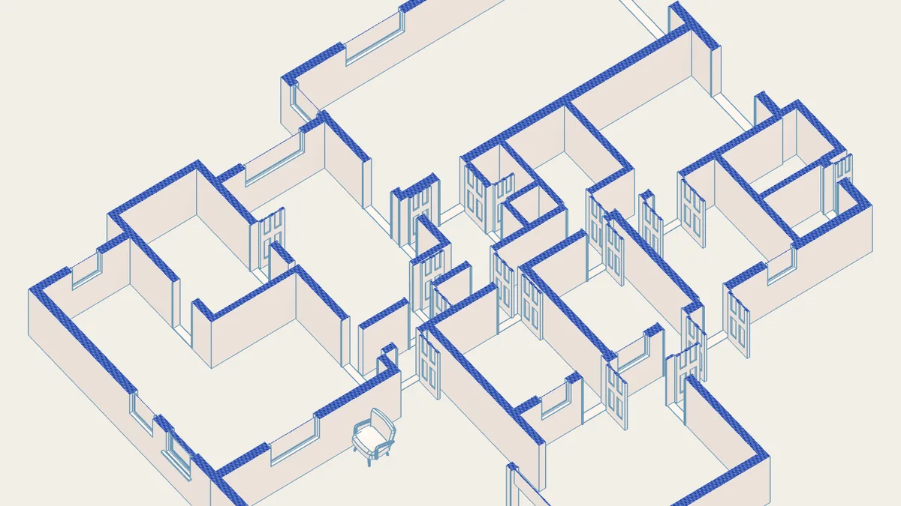
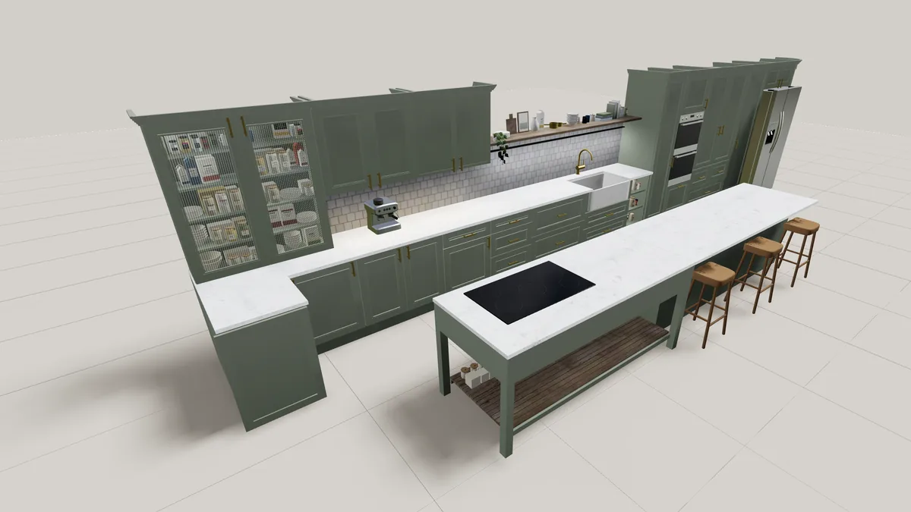

# Arcadium 3D — AI room planner and house design skill

[Arcadium 3D](https://arcadium3d.com/create-with-ai) is a browser-based room planner and house design tool. This AI skill helps your assistant turn floor plans, photographs, measurements or a written brief into an editable 3D home design that you can explore and develop in Arcadium.

Use it to plan a room layout, recreate an existing floor plan or work through a new house design. Your assistant creates the scene file; Arcadium provides the 3D viewing and editing tools. Walls, doors, windows and supported furniture remain individual, editable objects.

**[Create a 3D home design with your AI assistant →](https://arcadium3d.com/create-with-ai)**

## Why use Arcadium instead of asking AI to build a 3D app?

An AI assistant can interpret your floor plan and work through a design with you. Building a custom 3D app to display that design takes additional time and tokens, and means recreating controls for navigation, editing, furniture, materials and sharing.

Arcadium 3D already provides those tools in your browser. Your assistant focuses on the layout and returns a scene you can open and edit. Move a door, widen a window or try a furniture arrangement using Arcadium's controls, without regenerating the whole design for each adjustment. Native objects preserve what each piece is, so walls, doors and furniture remain individually editable.

## From floor plan to editable 3D design

<table>
<tr><th>Floor plan input</th><th>Arcadium 3D output</th></tr>
<tr>
<td></td>
<td><a href="https://arcadium3d.com/projects/635a61a7-641a-43bc-affd-1e0f6f5b6360"></a></td>
</tr>
</table>

[Open the example 3D project →](https://arcadium3d.com/projects/635a61a7-641a-43bc-affd-1e0f6f5b6360)

## What you can create

- **Room layouts:** explore how a living room, bedroom or home office could fit your space.
- **3D floor plans:** recreate a supplied plan using known measurements and identify any estimated dimensions.
- **House designs:** develop a layout from a brief describing rooms, sizes and priorities.
- **Furniture layouts:** ask your assistant to add supported native furniture after establishing the structure and scale.

Start with text, a floor plan or photographs, or combine them. Known measurements help establish scale; review any estimates before relying on the design.

## Install

Extract the ZIP and copy `skills/arcadium-home-design` into your assistant's supported skills directory. The assistant needs file creation for downloadable designs, image interpretation for plans or photos, and web access to check the latest instructions. No Arcadium API key is required.

For GitHub distribution, publish the extracted contents as a public repository. The `skills/arcadium-home-design/SKILL.md` layout supports skill discovery. Replace OWNER/REPOSITORY with that repository's actual name:

```sh
npx skills add OWNER/REPOSITORY --skill arcadium-home-design
```

## Try it

### Upload a floor plan

Upload your floor plan to your AI conversation, then ask:

“Use the Arcadium skill to turn this floor plan into an editable 3D home design. Preserve the layout, dimensions and door positions. Ask me about any measurements you need.”

### Upload photos of your space

Upload photos of your room or home from several angles, then ask:

“Use the Arcadium skill to recreate this space as an editable 3D design. Use the photos together and ask me about dimensions or anything you cannot reliably infer.”

You can combine a floor plan and photos in the same conversation. Include any measurements you have and describe changes you would like to explore.

The assistant returns a scene JSON or ZIP. Drop it onto https://arcadium3d.com/create-with-ai to preview it. Preview requires no login; Edit or Share requires sign-in to save the project.

## Keep developing your design

Explore furniture layouts and continue editing your space in Arcadium 3D.

[](https://arcadium3d.com/create-with-ai)

## Updates

This package is generated by Arcadium from the same instructions used on its create-with-AI page. Bundled revision: 5c1d1ed71d9d.

The skill checks https://arcadium3d.com/create-with-ai/instructions.txt when used and includes the generated instructions as a fallback. Download a fresh package from https://arcadium3d.com/create-with-ai/skill.zip to update the installed fallback or republish a listing. GitHub-installed users can run `npx skills update` after the repository is refreshed.

## Listing information

Name: Arcadium home design

Description: Use the Arcadium 3D AI skill for room planning, floor plans and house design. Turn plans, photos or a written brief into an editable 3D home design.

Website: https://arcadium3d.com/create-with-ai

Download: https://arcadium3d.com/create-with-ai/skill.zip

Categories: Home design, floor plans, 3D modelling, AI agent skills.

Set the repository or listing website field to the Arcadium page above. This package contains instructions and documentation; it is not an MCP server or a hosted generation API.
